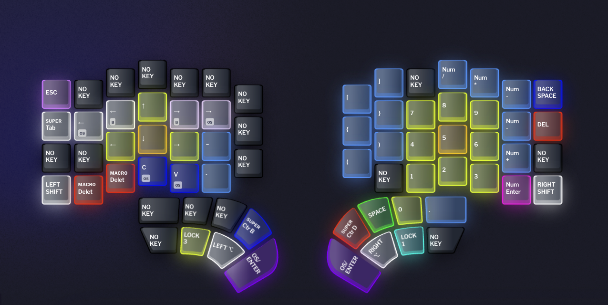
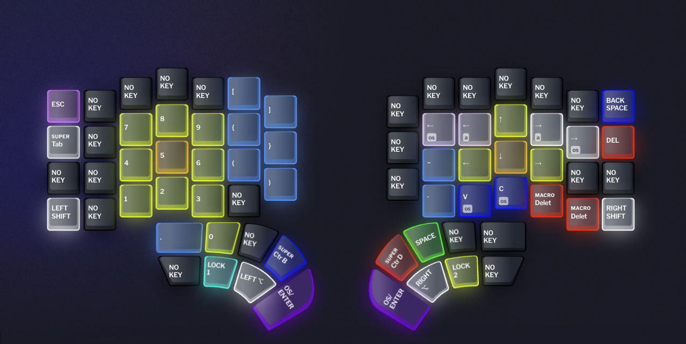
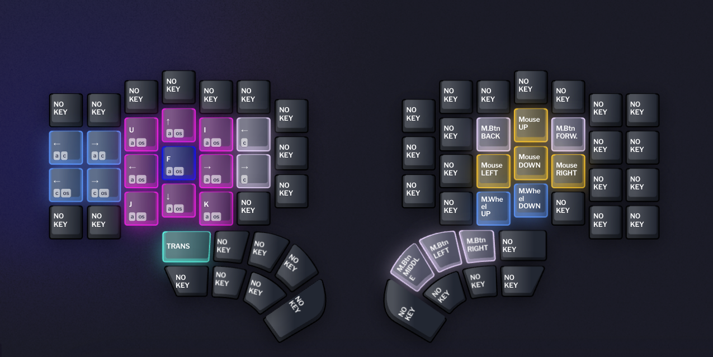

# My Defy Layers

The layers used for my [Dygma Defy](https://dygma.com/products/dygma-defy) keyboard.

## Default Layer

Normal QWERT keyboard with some adjustment on some lower frequency keys.

## Left Arrow / Right Num Pad

Normal Num Pad on the right.

## Right Arrow / Left Num Pad

Move cursor with right hand.

## Number Row

More easier way to access number row and the shift layer of it.

## Mac Window Management / Mouse Movement

Works with [Tiles](https://www.sempliva.com/tiles/), a window manager for macOS,

## Functional Row

12 function keys and some keyboard functions, such as: bluetooth connection and battery status.

